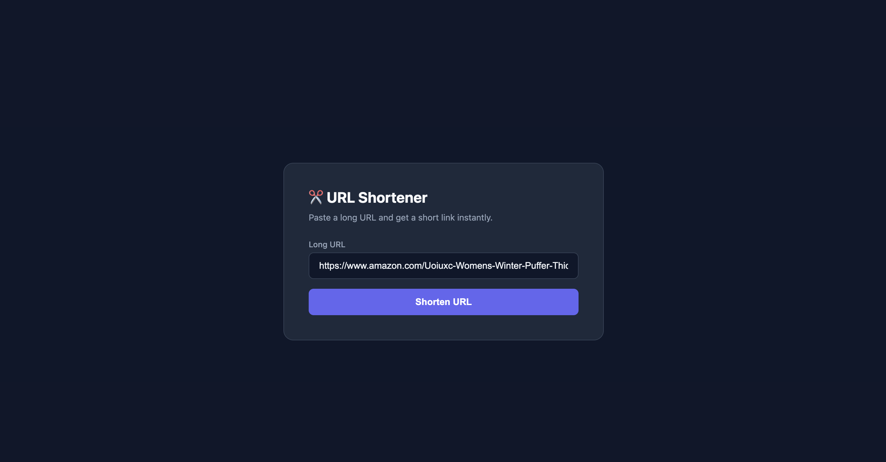
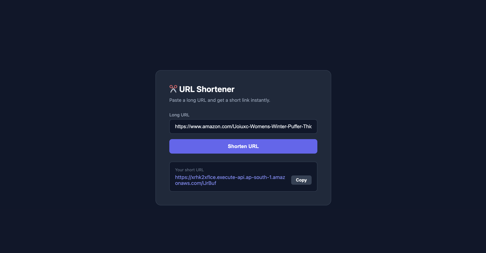
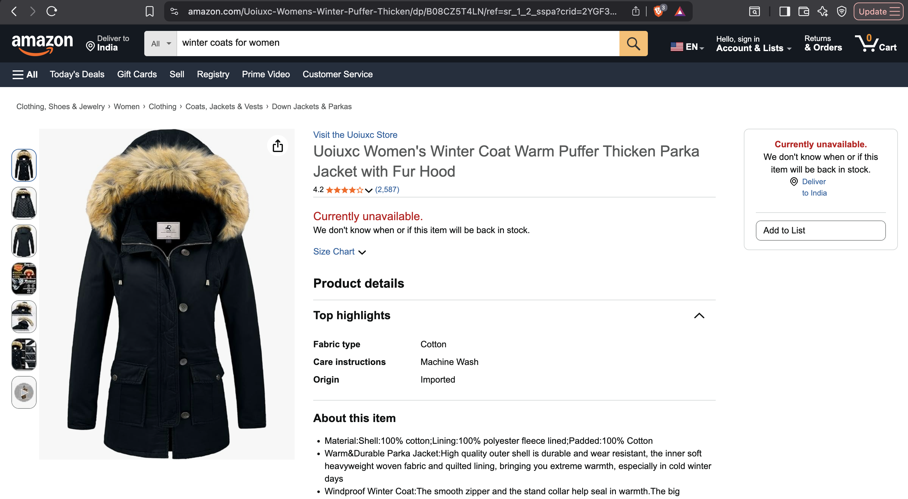
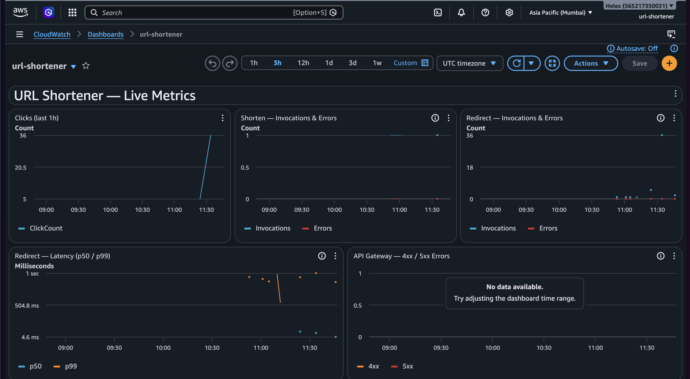
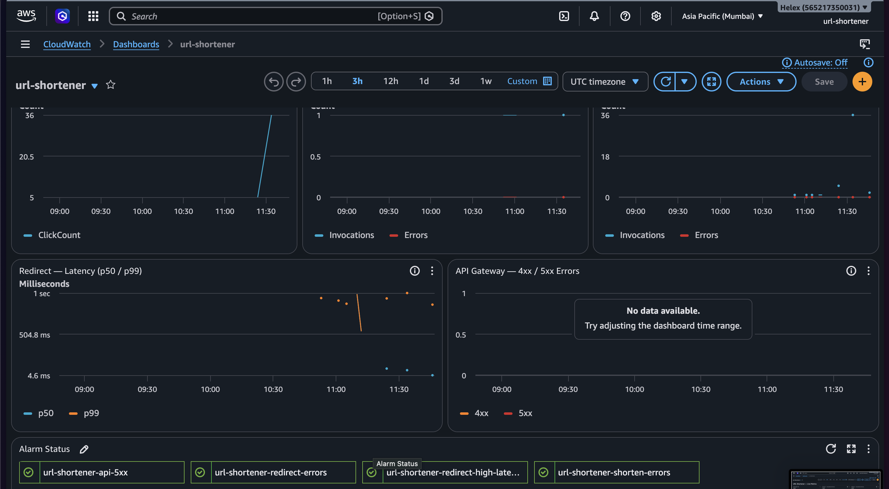

<div align="center">

# ⚡ Serverless URL Shortener

**A production-ready, fully serverless URL shortener built on AWS — managed entirely with Terraform.**

[](https://nodejs.org)
[](https://terraform.io)
[](https://aws.amazon.com/lambda/)
[](https://aws.amazon.com/dynamodb/)
[](LICENSE)

</div>

---

## 📐 Architecture


                            
## 🖥️ Frontend







---

## 📊 Monitoring Dashboard





> **Dashboard:**
> ['Dashboard'](screenshot/index2.png)

Metrics tracked: **click count** · **Lambda invocations** · **errors** · **p50 / p99 latency** · **API 4xx / 5xx**

---

## 🛠️ Stack

| Layer | Service |
|-------|---------|
| Database | DynamoDB (on-demand) |
| Compute | AWS Lambda (Node.js 20) |
| API | API Gateway HTTP API v2 |
| Frontend | S3 + CloudFront (OAC) |
| Analytics | DynamoDB Streams + Lambda |
| Monitoring | CloudWatch Alarms + Dashboard |
| Security | API Gateway throttling + WAF |
| IaC | Terraform |

---

## 📁 Project Structure

```
url-shortener/
├── infra/                       # All Terraform configuration
│   ├── main.tf                  # Provider and backend
│   ├── variables.tf             # Input variables
│   ├── outputs.tf               # Output values
│   ├── dynamo.tf                # DynamoDB table + streams
│   ├── iam.tf                   # IAM roles and policies
│   ├── lambda.tf                # Lambda function definitions
│   ├── apigateway.tf            # API Gateway + throttling
│   ├── s3.tf                    # S3 bucket + CloudFront
│   ├── cloudwatch.tf            # Alarms + dashboard
│   └── waf.tf                   # WAF WebACL
├── lambdas/
│   ├── shorten/                 # POST /shorten handler
│   │   └── index.mjs
│   ├── redirect/                # GET /{shortId} handler
│   │   └── index.mjs
│   └── analytics/               # DynamoDB Stream processor
│       └── index.mjs
├── frontend/
│   └── index.html               # Static UI
└── README.md
```

---

## ✅ Prerequisites

| Tool | Minimum version |
|------|----------------|
| [Terraform](https://developer.hashicorp.com/terraform/install) | v1.7+ |
| [AWS CLI](https://aws.amazon.com/cli/) | v2, configured with credentials |
| Node.js | v18+ |

---

## 🚀 Deploy

### 1. Clone the repo

```bash
git clone <your-repo-url>
cd url-shortener
```

### 2. Configure variables

```bash
cp infra/terraform.tfvars.example infra/terraform.tfvars
# Edit terraform.tfvars with your region and settings
```

### 3. Package Lambda functions

```bash
cd lambdas/shorten   && zip -r shorten.zip   index.mjs && cd ../..
cd lambdas/redirect  && zip -r redirect.zip  index.mjs && cd ../..
cd lambdas/analytics && zip -r analytics.zip index.mjs && cd ../..
```

### 4. Deploy with Terraform

```bash
cd infra
terraform init
terraform plan
terraform apply
```

### 5. Get your endpoints

```bash
terraform output api_url
terraform output cloudfront_url
```

---

## 🔌 API

### Shorten a URL

```bash
curl -X POST <api_url>/shorten \
  -H "Content-Type: application/json" \
  -d '{"originalUrl": "https://example.com/long/path", "userId": "user123"}'
```

**Response:**

```json
{
  "shortUrl":    "https://short.example.com/xK9mPq",
  "shortId":     "xK9mPq",
  "originalUrl": "https://example.com/long/path",
  "createdAt":   "2026-04-28T10:00:00.000Z"
}
```

### Follow a short URL

```bash
curl -v <api_url>/xK9mPq
# → HTTP 302  Location: https://example.com/long/path
```

---

## 🔒 Security

| Layer | Detail |
|-------|--------|
| API Gateway throttling | 20 req/s sustained · 50 req/s burst |
| WAF rate limiting | 100 requests / 5 min per IP |
| WAF managed rules | SQLi, XSS, known bad inputs |
| S3 | Private bucket · accessible only via CloudFront OAC |
| DynamoDB | Encrypted at rest · point-in-time recovery enabled |
| Lambda IAM | Least-privilege — only exact DynamoDB actions needed |

---

## 🗑️ Tear Down

```bash
cd infra
terraform destroy
```

> ⚠️ This permanently removes **all** AWS resources created by Terraform.

---

<div align="center">

Built with ❤️ on AWS + Terraform &nbsp;·&nbsp; [Open an issue](../../issues) &nbsp;·&nbsp; [Pull requests welcome](../../pulls)

</div>