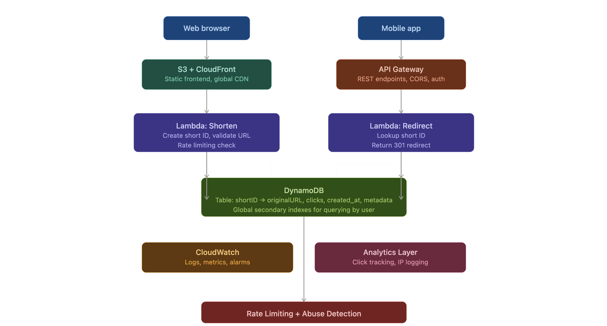

# Serverless URL Shortener

A fully serverless URL shortener built on AWS, managed entirely with Terraform.

## Architecture
```text
Browser / Mobile
      │
      ▼
S3 + CloudFront (Frontend)
      │
      ▼
API Gateway (HTTP API v2)
      │
      ├── POST /shorten ──► Lambda (Shorten) ──► DynamoDB
      │
      └── GET /{shortId} ──► Lambda (Redirect) ──► DynamoDB
                                  │
                                  ▼
                          DynamoDB Streams
                                  │
                                  ▼
                          Lambda (Analytics) ──► CloudWatch Logs
```


## Stack

| Layer | Service |
|-------|---------|
| **Database** | DynamoDB (On-demand) |
| **Compute** | AWS Lambda (Node.js 20) |
| **API** | API Gateway HTTP API v2 |
| **Frontend** | S3 + CloudFront |
| **Analytics** | DynamoDB Streams + Lambda |
| **Monitoring** | CloudWatch Alarms + Dashboard |
| **Security** | API Gateway Throttling + WAF |
| **IaC** | Terraform |

## Project Structure
```text
url-shortener/
├── infra/                  # Terraform configuration
│   ├── main.tf             # Providers & Backend
│   ├── dynamo.tf           # Table & Stream config
│   ├── lambda.tf           # Function definitions
│   └── ...                 # API, WAF, S3, IAM
├── lambdas/                # Node.js Handlers
│   ├── shorten/            # POST /shorten
│   ├── redirect/           # GET /{shortId}
│   └── analytics/          # Stream Processor
├── frontend/               # Static UI (index.html)
└── README.md
```

## Prerequisites
- [Terraform](https://developer.hashicorp.com/terraform/install) v1.7+
- [AWS CLI](https://aws.amazon.com/cli/) v2, configured with credentials
- Node.js v18+

## Deploy

### 1. Clone the repo
```bash
git clone <your-repo-url>
cd url-shortener
```

### 2. Package Lambda functions
*Note: Run these from the root directory to prepare the zip files for Terraform.*
```bash
zip -j lambdas/shorten.zip lambdas/shorten/index.mjs
zip -j lambdas/redirect.zip lambdas/redirect/index.mjs
zip -j lambdas/analytics.zip lambdas/analytics/index.mjs
```

### 3. Deploy with Terraform
```bash
cd infra
cp terraform.tfvars.example terraform.tfvars # Edit with your region/settings
terraform init
terraform apply
```

### 4. Get your URLs
```bash
terraform output api_url
terraform output cloudfront_url
```

## API Usage

### Shorten a URL
```bash
curl -X POST $(terraform output -raw api_url)/shorten \
  -H "Content-Type: application/json" \
  -d '{"originalUrl": "https://example.com/long/path", "userId": "user123"}'
```

### Follow a short URL
```bash
curl -i $(terraform output -raw api_url)/xK9mPq
# Returns: HTTP 302 Redirect
```

## Monitoring & Security
- **CloudWatch:** [Dashboard Link](https://amazon.com)
- **WAF:** Rate limiting (100 req/5min per IP) and AWS Managed Rules enabled.
- **Throttling:** 20 req/s sustained, 50 req/s burst.

## Tear Down
```bash
terraform destroy
```
